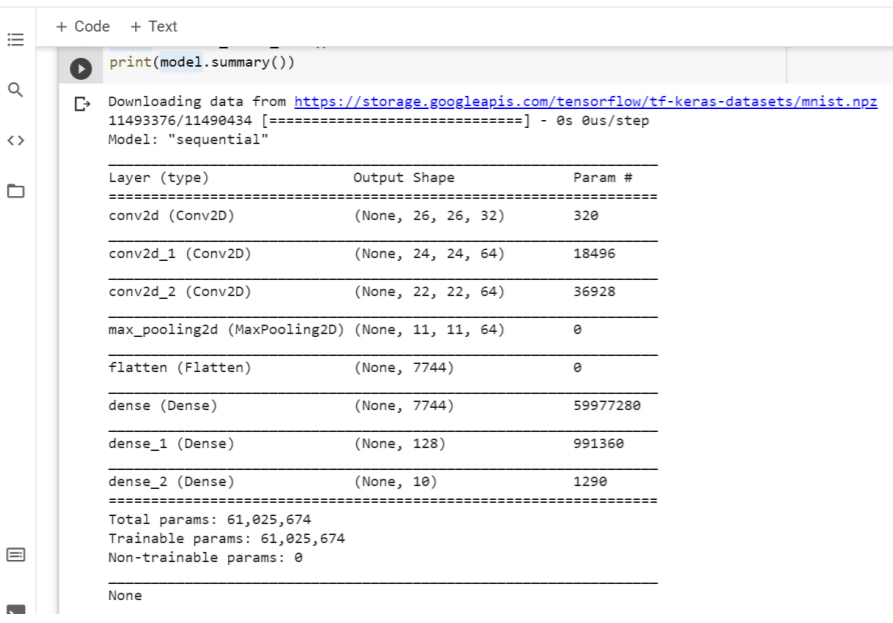
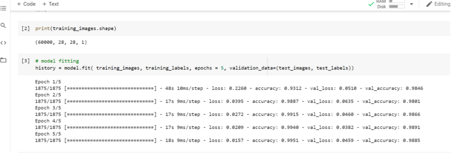
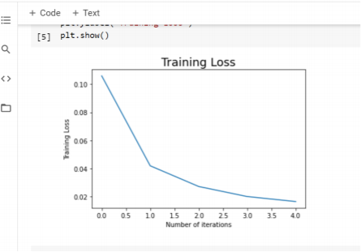
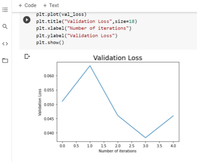
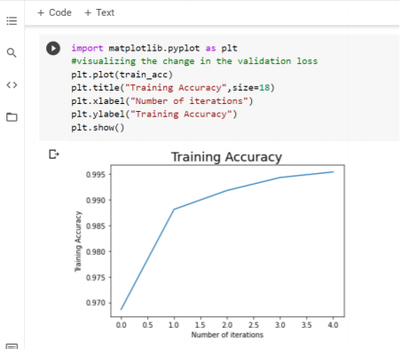
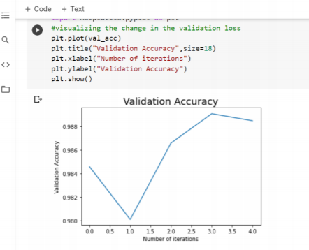
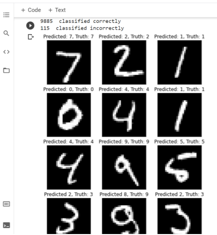

# Convolutional-Neural-Nets-for-MNIST-using-Keras

**Aim:**

To implement a convolutional neural network on the MNIST dataset and classify the digits from 0 to 9.

**Model Explanation:**

Here, we use the ’keras’ library to implement the forward and backward passes of the given convolutional neural network. First, we load, reshape and normalize the image data. Next, we build a model using 3 Conv2D layers, each of size (3 × 3) with 32, 64, and 64 kernels respectively. After the 3 Con2D layers, we use the MaxPooling2D layer of size (2 × 2) followed by a flatten layer to input into the fully connected layers. Once the input has been flattened after the 3 Conv2D and 1 MaxPooling2D layer, we pass it through 3 ’Dense’ layers in keras, which correspond to the 2 fully connected layers of size 7744 and 128 neurons respectively and one softmax layer having 10 neurons, with each neuron corresponding to one class label (here digit) in MNIST. Thus, we get our model summary as given below:

Further, we compile the model using the ’Adam’ optimizer and the loss function as 'sparse_categorical_crossentropy', which produces a category index of the most likely matching category as compared to the one-hot array containing the probable match for each category produced by the 'categorical_crossentropy' loss. Additionally, we include both the loss and accuracy metrics for the training and testing data.

Next, we train our model with training images, training labels and evaluate against our testing images and testing labels after each epoch. The dataset has been split into 60,000 training images along with its corresponding labels, and 10,000 testing images along with its corresponding labels. In the Colab notebook, the training set is given by training images, training labels, and the testing set is given by test images, test labels. We run the model for about 5 epochs and get an accuracy of 0.9951 on the training data, and an accuracy of 0.9885 on the test data as shown below:

We can also fit the model for higher epochs and measure the accuracy of the training and testing set after each epoch in a similar manner, but we take 5 epochs here for faster training. Now that the model has been trained, we can evaluate the model against the test set and plot the training loss and accuracy for both the test and train data.

Here, we see both the training and testing (validation) error generally decreases after each epoch. For the training loss, the error curve decreases smoothly, while for the validation loss, the error curve might go up due to overfitting on the training data for a given epoch, but generally decreases over the entire training period of 5 epochs.

Similarly, the accuracy plots for both the train and test data are:

Here, we see that the accuracy for both the training and testing (validation) data generally increases after each epoch. For the training accuracy, the curve increases smoothly, while for the validation accuracy, the curve might go down due to overfitting on the training data for a given epoch, but generally increases over the entire training period of 5 epochs.

Now, we also evaluate our model against the test data as given by the figure below. Additionally, we plot a total of 18 images, 9 of which were correctly classified by our model and 9 of which were incorrectly classified by our model to compare the true output and the predicted output.

Here, we see that out of the 10,000 images in the test data, our model classifies 9885 images correctly, thus verifying the accuracy of the test data. Note that the accuracy of the model can be increased by running for higher epochs but here we limit the training to 5 epochs for faster training process.
